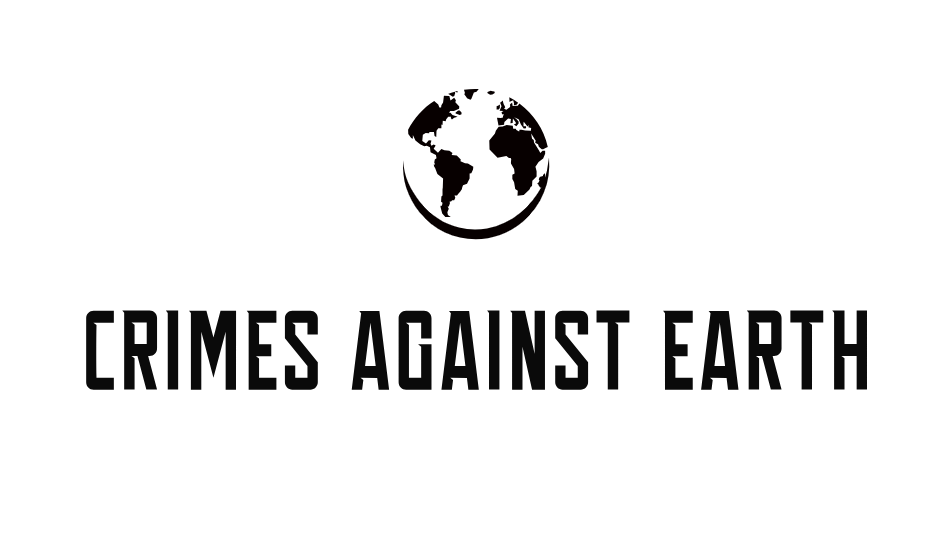

 

# Crimes Against Earth

Crimes Against Earth brings real-time information on air quality and carbon emissions. Utilizing API's, we create different functionalities to the user that allow them to get accurate data for what they are lookin for. Our application allows users to look-up the air quality of cities, take quizzes, explore articles based on Carbon Emission and Air Quality, and utilize a map GUI to explore the air quality of the world.

## Authors

- [Jerry Nguyen Dinh](https://github.com/jdinh14)
- [Jessica Contreras Ayala](https://github.com/Lara-Crofts)
- [Brooke Evans](https://github.com/bevans14)
- [Tommy Phi](https://github.com/TommyPhi)

## Features

- Air Quality City Lookup
- Informational Quiz
- Air Quality/Carbon Emission Articles
- Map GUI

## API's

## Acknowledgements

 - [Materialize CSS](https://materializecss.com/)
 - [Amazon RDS](https://aws.amazon.com/rds/)
 - [Air Quality & Climate Change](https://www.epa.gov/air-research/air-quality-and-climate-change-research)

## Feedback

If you have any feedback, please reach out to us at crimesagainstearth@gmail.com